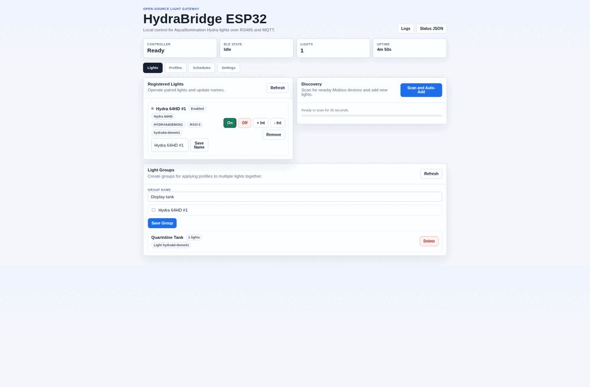

# HydraBridge ESP32

## Legal Notice

HydraBridge ESP32 is an independent, open-source interoperability project. It is not affiliated with, endorsed by, sponsored by, or approved by AquaIllumination, Mobius®, or their owners.

This project was reverse engineered using a clean-room method solely to enable local interoperability with the author's personally owned AquaIllumination Hydra® lights in a personal PLC reef controller. The repository is intended to contain independently written code, protocol documentation, and functional facts needed for interoperability only; it does not include vendor firmware, vendor source code, vendor application code, copyrighted artwork, cloud services, or product keys.

Under U.S. law, this project is intended to rely on the interoperability reverse-engineering provisions of [17 U.S.C. § 1201(f)](https://www.law.cornell.edu/uscode/text/17/1201), which permit identifying, analyzing, and sharing information necessary for interoperability of independently created computer programs, and on fair-use principles under [17 U.S.C. § 107](https://www.law.cornell.edu/uscode/text/17/107). U.S. courts have recognized this kind of software reverse engineering and clean-room reimplementation for compatibility in cases including:

- [Sega Enterprises Ltd. v. Accolade, Inc., 977 F.2d 1510 (9th Cir. 1992)](https://www.copyright.gov/fair-use/summaries/segaenters-accolade-9thcir1992.pdf), recognizing reverse engineering of software to access unprotected functional elements needed for compatibility as fair use.
- [Sony Computer Entertainment, Inc. v. Connectix Corp., 203 F.3d 596 (9th Cir. 2000)](https://law.justia.com/cases/federal/appellate-courts/F3/203/596/474793/), recognizing intermediate copying during reverse engineering as fair use when used to build a non-infringing interoperable implementation.
- [Lexmark International, Inc. v. Static Control Components, Inc., 387 F.3d 522 (6th Cir. 2004)](https://law.justia.com/cases/federal/appellate-courts/F3/387/522/532493/), rejecting an overbroad use of the DMCA to block interoperable replacement components and warning against using access controls to create replacement-part monopolies.
- [Computer Associates International, Inc. v. Altai, Inc., 982 F.2d 693 (2d Cir. 1992)](https://digital-law-online.info/cases/23PQ2D1241.htm), applying abstraction-filtration-comparison principles and recognizing that independently rewritten software constrained by functional requirements can avoid copyright infringement.

This notice is provided for project context only and is not legal advice. Laws vary by jurisdiction, and downstream users are responsible for ensuring their own use complies with applicable law, license terms, and device ownership rights.

HydraBridge ESP32 is an open-source gateway that connects AquaIllumination Hydra® lights to industrial and home automation systems.

Local control for AquaIllumination Hydra® lights over RS485 and MQTT.



Features include:

- Automatic Hydra® light discovery
- Local BLE communication
- Browser-based setup and control UI
- MQTT integration with optional Home Assistant auto-discovery
- RS485 / Modbus RTU slave support for PLC and automation controllers
- Reusable built-in and custom lighting profiles
- Scheduled lighting control for individual lights and light groups
- SNTP time sync with local sunrise and sunset scheduling
- First-boot WiFi setup hotspot
- Web-based OTA firmware updates
- Multi-light group support
- Fully local operation with no cloud dependency

This ESP32-S3 controller talks to **AquaIllumination Hydra®** lights directly over BLE using the reverse-engineered myAI / Mobius® protocol, with MQTT integration and a Modbus RTU slave register map for PLC integration.

**Target hardware**: This project is developed and release-tested for the [Waveshare ESP32-S3-RS485-CAN](https://www.waveshare.com/wiki/ESP32-S3-RS485-CAN#Onboard_Resources). That board provides the expected ESP32-S3 MCU, 2.4 GHz WiFi/BLE, 16MB flash, USB-C flashing/debug, wide-range screw-terminal power input, and onboard isolated RS485 hardware.

Other ESP32-S3 boards can run HydraBridge ESP32, but may need changes before flashing: confirm flash size and partition layout, wire or add an RS485 transceiver if you need Modbus, update RS485 GPIOs in Settings or defaults, and verify USB/serial flashing behavior for that board. BLE, WiFi, MQTT, and the web UI do not require the Waveshare RS485/CAN hardware.

## What works today

| Surface | Status |
|---|---|
| FSCI / myAI protocol codec | ✅ Byte-exact verified against captured hardware traces (CRC, builder, parser, reassembly) |
| Channel model + presets | ✅ 9-channel Hydra® 64HD model, command presets, and reef profile support |
| Lighting profiles | ✅ Built-in coral profiles plus user-created profiles with descriptions |
| LiveDemoScene payload builder | ✅ Reproduces captured On/Off/LBM/Moonlight TX frames byte-for-byte |
| Light registry + command queue | ✅ 4 lights, 4 groups, renaming, auto-reconnect metadata, per-light FIFO with coalescing, NVS persistence |
| Command engine | ✅ Unified `ce_request_t` → validate → expand → enqueue from any source |
| BLE discovery and light control | ✅ Scans, registers, reconnects, pairs, and writes commands to Hydra® lights |
| Web UI | ✅ Local browser UI for discovery, lights, groups, profiles, schedules, OTA, MQTT, RS485, WiFi, time, and sun settings |
| Lighting schedules | ✅ NVS-backed schedules targeting lights or groups, with fixed-time, sunrise, sunset, intensity, profile, and ramp controls |
| Time and sun events | ✅ Optional SNTP sync, POSIX timezone setting, and local sunrise/sunset calculation from configured coordinates |
| Modbus RTU slave | ✅ Optional ESP-Modbus RTU slave; disabled by default, configurable from the web UI |
| Modbus register map | ✅ Full spec map (system + 4 light + 4 group blocks) with result codes 1:1 to `ce_result_t` |
| MQTT bridge | ✅ Optional MQTT client; disabled by default; configurable from the web UI; light/group command subscriptions and result topics |
| Home Assistant discovery | ✅ Optional MQTT discovery publishing when MQTT is enabled and the HA checkbox is on |
| OTA partition + rollback | ✅ Two app slots, `esp_ota_mark_app_valid_cancel_rollback` on good boot |
| WiFi setup portal | ✅ First-boot setup hotspot at `HydraBridge-Setup` / `http://192.168.1.10/`, configurable from Settings |
| Release workflow | ✅ GitHub Actions builds ESP32-S3 firmware and publishes release assets on version tags |

Today: the controller can be flashed from a release asset, joined to WiFi through the setup portal, discover and register Hydra® lights, control them locally over BLE, expose automation through MQTT and Modbus, and run local lighting schedules without cloud services.

## Planned work

The current public backlog is tracked in GitHub issues:

| Area | Issue |
|---|---|
| Static IP and configurable hostname settings | [#5](https://github.com/roygabriel/hydrabridge-esp32/issues/5) |
| Optional username/password authentication | [#6](https://github.com/roygabriel/hydrabridge-esp32/issues/6) |
| AI pump support | [#7](https://github.com/roygabriel/hydrabridge-esp32/issues/7) |
| Comprehensive public API documentation | [#8](https://github.com/roygabriel/hydrabridge-esp32/issues/8) |

## Repo layout

```
main/                        ESP-IDF app entrypoint + idf_component.yml
components/
  fsci_codec/                CRC + frame builder + parser + reassembly
  hydra64hd_protocol/        SupportedColorChannels read + LiveDemoScene write payload builders
  channel_model/             Canonical 9-channel set, name lookup, validation
  preset_engine/             Command presets
  light_registry/            Registered lights + named groups (NVS-backed)
  ble_scanner/               Hydra advertisement parsing
  ble_light_client/          NimBLE central scan/connect/GATT command worker
  command_queue/             Per-light bounded FIFO with coalescing
  command_engine/            ce_request_t → ce_result_t pipeline (Modbus / MQTT / web all converge here)
  modbus_interface/          Holding-register store + ESP-Modbus driver + RS485 UART wiring
  mqtt_bridge/               Optional MQTT client + JSON command-payload parser
  ha_discovery/              Home Assistant MQTT discovery publisher
  config_store/              Per-category NVS-backed config
  event_log/                 Bounded ring + password redaction
  ota_update/                Web-upload OTA + rollback cancel
  schedule_engine/           Local lighting schedule evaluation and command dispatch
  sun_service/               Local sunrise/sunset calculation
  time_service/              SNTP and timezone handling
  web_ui/                    Embedded HTTP API and browser UI
  wifi_station/              WiFi station mode, setup AP fallback, and mDNS
docs/
  ble-protocol-reference.md            Clean technical reference for the BLE protocol
  rs485-modbus-protocol.md             RS485 / Modbus command reference
  quickstart.md                        Flashing and first-boot setup guide
  time-sun-schedules.md                SNTP, local sunrise/sunset, and lighting schedules
host_tests/                  Unity-based host tests for pure-C modules
```

## Quickstart

Nontechnical users should start with the release firmware zip instead of building from source:

1. Download the latest `hydrabridge-esp32-firmware-*.zip` from GitHub Releases.
2. Flash it with `flash.sh` on Linux/macOS or `flash.ps1` on Windows.
3. Connect to the first-boot `HydraBridge-Setup` WiFi hotspot.
4. Open `http://192.168.1.10/` and save your home WiFi settings.

Full steps are in [docs/quickstart.md](docs/quickstart.md).

## Build From Source

Install ESP-IDF 5.4+, then:

```bash
. ~/esp/esp-idf/export.sh
idf.py set-target esp32s3
idf.py build
idf.py -p /dev/ttyUSB0 flash monitor
```

`esp-modbus` is pulled automatically via the IDF Component Registry on first configure.

## Host tests

Pure-C modules (protocol codec, channel model, presets, registries, queue, engine, Modbus store, MQTT parser, sun calculations, schedules, and config defaults) compile to a Linux binary using Unity:

```bash
. ~/esp/esp-idf/export.sh   # Unity is pulled from $IDF_PATH/components/unity
cmake -S host_tests -B host_tests/build
cmake --build host_tests/build
./host_tests/build/host_tests
```

Currently **179 tests** across 17 test files. Coverage includes captured CRCs, captured TX/RX frames, presets, Modbus dispatch paths, MQTT payloads, light registry/group behavior, config defaults, event-log redaction, sun calculations, and schedule timing logic.

## RS485 / Modbus quick start

RS485 is disabled by default. Enable it from the web UI `RS485 Slave` section, then configure the external Modbus master with matching settings:

| Setting | Default | Override |
|---|---|---|
| Slave address | `10` | NVS (`mb_cfg` namespace) |
| Baud | `19200` | NVS |
| Data/stop bits | `8` / `1` | Fixed by bundled ESP-Modbus serial port |
| Parity | `even` | Web UI / NVS |
| UART TX / RX / DE pins | `17 / 18 / 4` | Web UI / NVS |

A Modbus master reads, once RS485 is enabled:

```
register 0  → 0xA164    (magic; if you see this the controller is alive)
register 1  → 1         (register-map version)
register 16 → 1         (modbus_status = slave_ready)
```

To turn light 0 on, write command code first and sequence last:

```
register 1006 → 2   (command_code = ON)
register 1005 → 1   (command_seq = new sequence)
```

The controller picks up the `command_seq` increment, dispatches via `command_engine`, and writes the result code to register `1003`. Full usage docs are in [`docs/rs485-modbus-protocol.md`](docs/rs485-modbus-protocol.md), with constants in [`components/modbus_interface/include/modbus_registers.h`](components/modbus_interface/include/modbus_registers.h).

## References

- [BLE protocol reference](docs/ble-protocol-reference.md) — clean technical writeup
- [RS485 / Modbus protocol](docs/rs485-modbus-protocol.md) — register map and command examples
- [Time, sun events, and schedules](docs/time-sun-schedules.md) — SNTP, local sunrise/sunset, and lighting schedule reference
- [Quickstart](docs/quickstart.md) — flashing and first-boot setup

## License

HydraBridge ESP32 is released under the [MIT License](LICENSE).

## No Warranty And User Responsibility

HydraBridge ESP32 is provided "as is", without warranty of any kind, express or implied, including without limitation any warranties of merchantability, fitness for a particular purpose, non-infringement, electrical safety, regulatory compliance, or suitability for aquarium, livestock, industrial, automation, or life-support use. You use, modify, flash, wire, and operate this software and any connected hardware entirely at your own risk.

The maintainers and contributors are not responsible or liable for any claim, damage, loss, injury, equipment failure, livestock loss, data loss, business interruption, regulatory violation, unsafe wiring, unauthorized access, misuse, or other liability arising from or related to this project, whether in an action of contract, tort, negligence, product liability, or otherwise. Users are solely responsible for verifying safe installation, lawful use, electrical isolation, fail-safe behavior, backups, monitoring, and compliance with all applicable laws, regulations, licenses, and third-party rights.

## Trademark Notice

Hydra® and Mobius® are registered trademarks of ECOTECH, LLC. EcoTech Marine and AquaIllumination are brands associated with EcoTech, LLC and/or Aperture, LLC. HydraBridge ESP32 is an independent interoperability project and is not sanctioned, authorized, affiliated with, endorsed by, sponsored by, maintained by, or supported by EcoTech, LLC, EcoTech Marine, AquaIllumination, Aperture, LLC, or any of their respective parents, subsidiaries, affiliates, successors, or assigns. Use of third-party names and marks is solely nominative, to identify compatible hardware and protocols, and does not imply any commercial relationship, approval, warranty, or fitness representation by those trademark owners.
